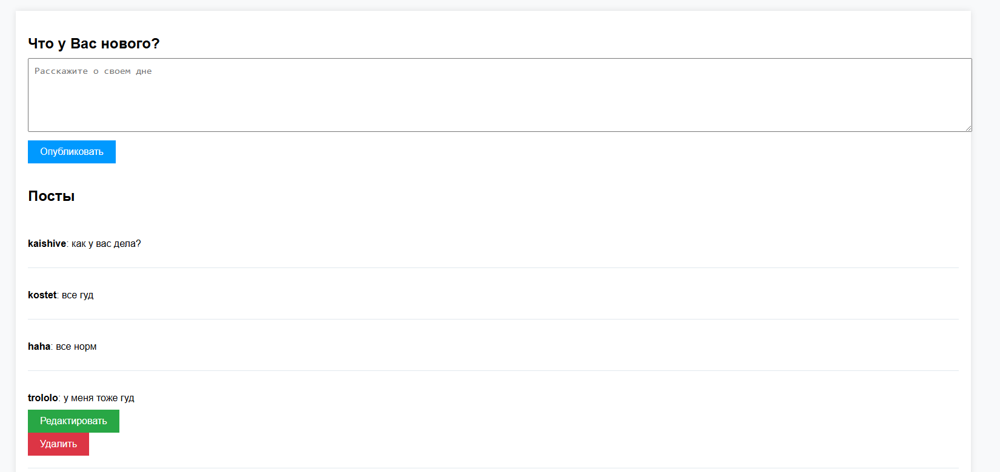

# Chat Application (Чат на FastAPI)


## Обзор проекта

Это веб-приложение на **FastAPI**, представляющее собой чат для пользователей. Оно включает следующие возможности:

- **Регистрация и аутентификация пользователей**: Позволяет новым пользователям зарегистрироваться и существующим пользователям войти в систему.
- **Создание, редактирование и удаление сообщений**: Пользователи могут отправлять сообщения в чат, а также редактировать или удалять свои собственные сообщения.
- **Отображение сообщений в реальном времени**: Чат обновляется и отображает новые сообщения по мере их поступления.

## Установка и запуск

### Требования

- Python 3.x
- FastAPI
- Uvicorn
- SQLAlchemy
- Alembic
- Другие зависимости, указанные в `requirements.txt`

### Инструкции по установке

1. **Клонируйте репозиторий с помощью Git**:

   ```bash
   git clone https://github.com/Kaishivee/blog_app.git
   ```

2. **Создайте и активируйте виртуальное окружение**:

   ```bash
   python -m venv venv
   # Для Windows:
   venv\Scripts\activate
   # Для Unix/MacOS:
   source venv/bin/activate
   ```

3. **Установите зависимости**:

   ```bash
   pip install -r requirements.txt
   ```

4. **Настройте базу данных**:

   - В файле `database.py` проверьте строку подключения к базе данных.
   - По умолчанию используется SQLite, но можно настроить другую СУБД при необходимости.

5. **Примените миграции базы данных с помощью Alembic**:

   ```bash
   alembic upgrade head
   ```

6. **Запустите приложение**:

   ```bash
   if __name__ == "__main__":
    import uvicorn

    uvicorn.run(app, host="127.0.0.1", port=8000)
   ```

7. **Откройте браузер и перейдите по адресу** ` http://127.0.0.1:8000` **для доступа к приложению**.

## Использование

### Регистрация и вход

- **Регистрация**:
  - На главной странице вы можете зарегистрироваться, заполнив форму с вашим именем пользователя и паролем.

- 

- **Вход**:
  - Если у вас уже есть учетная запись, перейдите на страницу входа и введите свои учетные данные.
- 

### Чат

- **Просмотр сообщений**:
  - После входа вы увидите список сообщений, отправленных всеми пользователями.
  - 
- **Отправка сообщений**:
  - Введите ваше сообщение в поле ввода и нажмите "Отправить".
  - 
- **Редактирование сообщения**:
  - Рядом с вашими сообщениями отображается кнопка "Редактировать". Нажмите ее, чтобы изменить сообщение.
  - 
- **Удаление сообщения**:
  - Рядом с вашими сообщениями отображается кнопка "Удалить". Нажмите ее, чтобы удалить сообщение.
  - 


## Структура проекта

Проект состоит из следующих ключевых компонентов:

- **main.py**: Основной файл приложения FastAPI.
  - Инициализирует приложение.
  - Подключает роутеры из директории `routers`.
  - Настраивает статические файлы и шаблоны.

- **models/post_user_model.py**: Определение моделей базы данных с использованием SQLAlchemy.
  - `User`: Модель пользователя с полями `id`, `username`, , `email`, `hashed_password`, `slug`.
  - `Post`: Модель сообщения с полями `id`, `content`, `slug`, `user_id`.

- **routers/**: Директория с модулями маршрутизации.
  - **posts_crud.py**:
    - Маршруты для создания, чтения, обновления и удаления сообщений.
    - Проверка аутентификации пользователя через cookie `user_id`.
  - **register.py**:
    - Маршруты для регистрации и входа пользователей.
    - Обработка форм регистрации и входа.

- **templates/**: HTML-шаблоны для отображения страниц.
  - **main_page.html**: Шаблон главной страницы с формой регистрации и входа.
  - **login.html**: Шаблон страницы входа.
  - **page_blog.html**: Шаблон страницы чата с отображением сообщений.
  - **edit_post.html**: Шаблон для редактирования сообщения.

- **database.py**: Настройка подключения к базе данных.
  - Настраивает соединение с базой данных.
  - Конфигурирует сессию SQLAlchemy.

- **schemas.py**: Определение Pydantic-схем для валидации данных.
  - Схемы для пользователей и сообщений.

## Решение проблем

- **Проблемы с запуском приложения**:
  - Убедитесь, что установлены все зависимости из `requirements.txt`.
  - Проверьте, что виртуальное окружение активировано.
  - Удостоверьтесь, что команды `uvicorn` и `alembic` доступны в вашем PATH.

- **Ошибки базы данных**:
  - Убедитесь, что настройки базы данных в `database.py` корректны.
  - Проверьте, что миграции базы данных были успешно применены с помощью Alembic.

- **Аутентификация не работает**:
  - Убедитесь, что браузер принимает cookies.
  - Проверьте маршруты в `routers/register.py` и `routers/posts_crud.py` для правильной обработки сессий.
